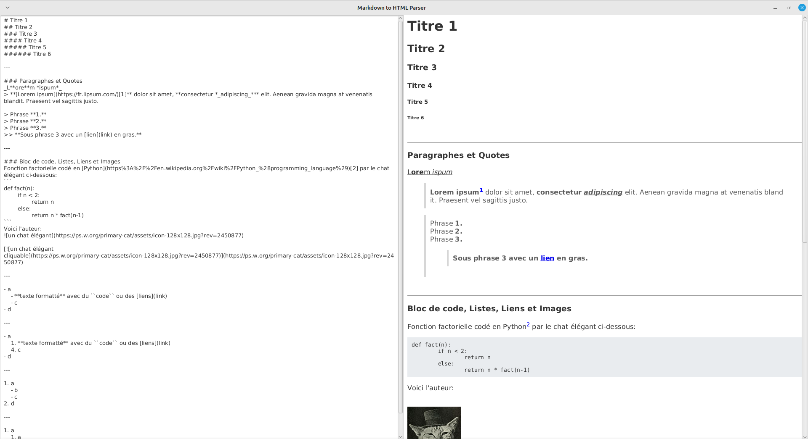
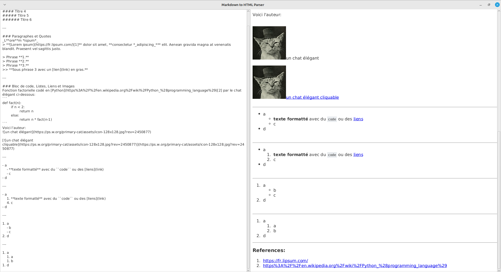

# md2html

Un parser Markdown vers HTML très basique écrit en Java et basé sur [JavaFX](https://gluonhq.com/products/javafx/) pour l'interface graphique.

> La version 17 du JDK Java et la version 17.0.7 du SDK JavaFX a été utilisé pour la réalisation de ce projet.
>
> **Il faut donc une version égale ou supérieure à 17 du JDK Java et du SDK JavaFX pour lancer correctement ce programme.**

Le programme suit les standards de syntaxe décrit sur ce site (https://www.markdownguide.org/basic-syntax/).

> Particularité des notes de bas de page : la liste ordonnée de tous les liens correspondant à chaque note de bas de page est générée au fur et à mesure que l'on écrit dans le programme.

| Aperçu 1 | Aperçu 2 |
|---|---|
|   |   |

Le programme ne suit pas à la lettre tous les standards de la page ci-dessus, il manque quelques syntaxes, fonctionnalités:
- La possibilité d'intégrer des listes, sous-listes dans les quotes.
- Ajouter des images entre 2 items de liste (notamment des listes ordonnées qui conserveraient l'ordre).
- Cacher le titre des images ou du lien des images.
- Il faut au préalable encoder le lien au format URL quand il y a le caractère spécial ")" qui rentre en conflit avec la syntaxe des liens hyper-textes.
- ou d'autres moins essentiels comme l'affichage d'un titre lorsqu'on survole un lien hyper-texte, transformer automatiquement un texte qui a le format URL, email en lien sans syntaxe nécessaire.

### Commande de lancement

La release de la dernière version du fichier JAR se trouve juste [ici](https://github.com/mortim/md2html/releases/tag/v2.0.1).

```
java --module-path [CHEMIN_ABSOLU_DU_DOSSIER_LIB_DE_JAVAFX] --add-modules javafx.controls,javafx.web -jar md2html-v2.0.1.jar
```
