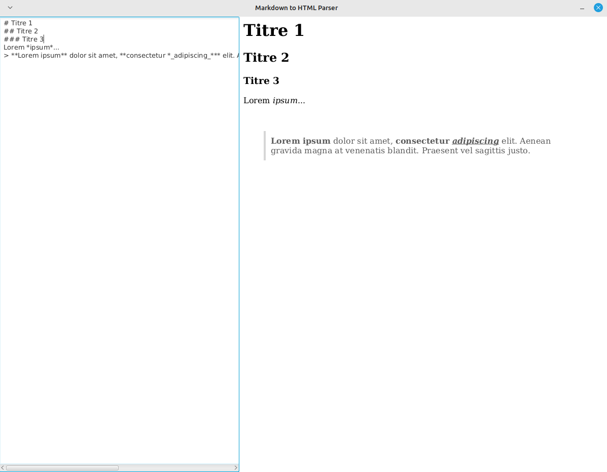

# md2html

Un parser Markdown vers HTML très basique écrit en Java et basé sur [JavaFX](https://gluonhq.com/products/javafx/) pour l'interface graphique.

> La version 17 du JDK Java et la version 17.0.7 du SDK JavaFX a été utilisé pour la réalisation de ce projet.



### Commande de lancement

```
java --module-path [CHEMIN_ABSOLU_DU_DOSSIER_LIB_DE_JAVAFX_17] --add-modules javafx.controls,javafx.web -jar md2html.jar
```
